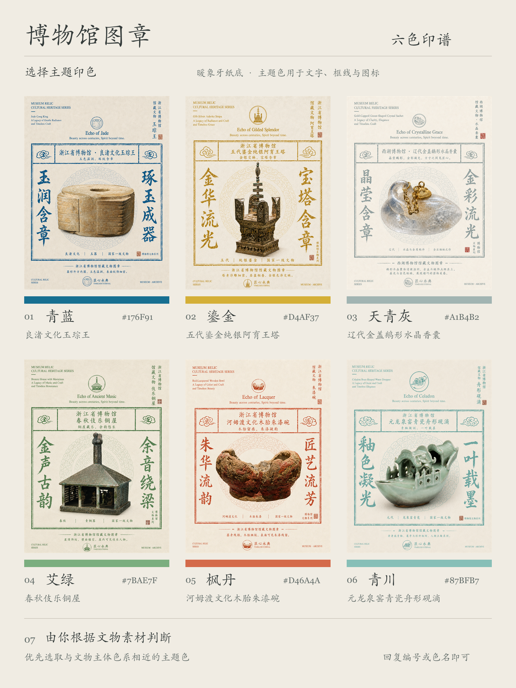

# 博物馆图章 · Museum Relic Stamp

**将逛博物馆时一眼打动你的文物，做成一枚可供收藏的专属图章。**

上传一张逛展时拍的文物照片，制作成一张兼具旧纸质感、印章意趣与中英排版的文物收藏图章海报。

玉器的温润、青瓷的釉泽、青铜的斑驳锈迹，都将保留在画面之中。

再搭配一款合意的印色，为每一件心仪文物，生成独属于它的收藏页。

**制作者：@木渡川（TANGLELE）**



整套共有六款印色，统一采用暖象牙旧纸底色。

你既可以为不同文物分别匹配色调，也可以固定一款印色，慢慢攒出属于自己的博物馆观展收藏册。

## 只需一张照片、一段简单描述，即可开始使用

上传文物照片，直接向 AI 下达指令即可，示例参考：

> 使用博物馆图章 Skill，将这张浙江省博物馆的良渚文化玉琮王的照片制作成图章，选用青蓝色。

如果拿不准适配的色彩，也可以交由工具判断：

> 由你根据文物本身的颜色，帮我选一个合适的主题色。

未指定颜色时，Skill 会先展示色卡，供你手动选择。

请尽量提供准确的文物名称、馆名等信息。

## 印色参考

| 印色 | 气质 | 色号 |
| --- | --- | --- |
| **青蓝** | 沉静清朗，复刻档案旧印质感 | `#176F91` |
| **鎏金** | 庄重温暖，烘托器物细节光泽 | `#D4AF37` |
| **天青灰** | 淡雅含蓄，自带朦胧诗意 | `#A1B4B2` |
| **艾绿** | 古雅温润，暗含草木气韵 | `#7BAE7F` |
| **枫丹** | 醇厚明快，如同旧纸上的朱印 | `#D46A4A` |
| **青川** | 清润悠远，契合青瓷水色意境 | `#87BFB7` |

也支持自定义颜色。

主题色仅作用于文字、边框与装饰元素，纸张基底始终为暖象牙色，**改变的是印章色彩，保留的是文物本身的样貌**。

## 适用范围

不只是青铜器，瓷碗、玉器、造像、书画，各类文物都可以作为创作主体。

工具会依据器物形态调整排版布局：高长器物预留充足纵向空间，扁平物件维持原始平面比例，残损器物如实保留原貌。

样例仅作风格参考，最终呈现效果由你提供的实拍照片决定。

可以用来制作这些内容：

- **观展纪念**：为逛馆当日最喜爱的文物留存一页收藏记录
- **文物笔记**：将实拍照片、器物名称与已知史料整合在同一画面
- **主题合集**：归集不同博物馆的青瓷、玉器或是其他专题藏品
- **社交配图**：为观展随笔，制作辨识度十足的配套海报

## 安装方式

下载本仓库，将完整的 `museum-relic-stamp` 文件夹放置到 AI 工具对应的 Skill 目录下，按照工具说明完成重载即可。

请勿删除文件夹内附带的图片与参考文档。安装完成后，可直接口述 “调用博物馆图章”；部分工具内也可使用指令调用：

```text
$museum-relic-stamp
```

注意：需要 AI 工具具备参考图读取、图像编辑能力。

本仓库仅提供 Skill 脚本、提示词以及风格样例，图像生成服务与相关消耗，由你所使用的 AI 工具提供。

## 输出说明与注意事项

默认输出为**3:4 竖版构图**，基础分辨率 `768 × 1024`，也可选择更高规格 `1536 × 2048`。

图片与文字为一次性生成，偶尔会出现文字错漏、细节失真或是尺寸偏差。导出前建议人工复核，尤其留意文物名称与小字注释。文档内的六张展示样例分辨率为 `1086 × 1448`，仅用作风格演示。

本项目属于个人创作工具，生成的图像不等同于博物馆官方出品物料。

## 开源协议与复用规范

- 脚本、提示词及本文档采用 **MIT 协议**；
- 制作者可授权的原创视觉素材，遵循 **CC BY 4.0**；
- 官方文物图源、字体以及其余第三方资源，继续沿用其原有版权约束。

复用skil里附带的原创视觉内容时，请做好署名、标注协议许可，并说明改动内容，示例格式：

> 原创视觉：@木渡川（TANGLELE）  
> 许可：CC BY 4.0  
> 修改：调整配色与构图

完整协议内容见仓库内 `LICENSE`、`LICENSE-ASSETS.md`，素材来源、字体使用限制均有单独记录。
