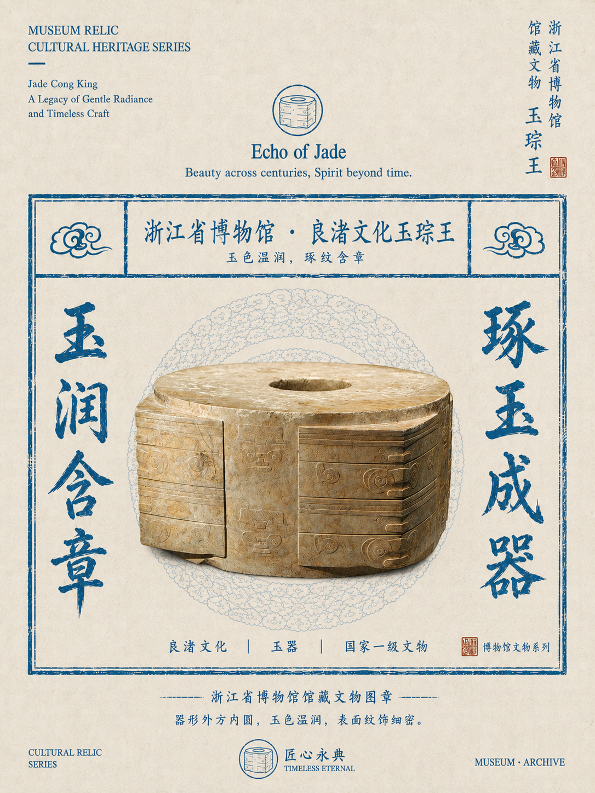
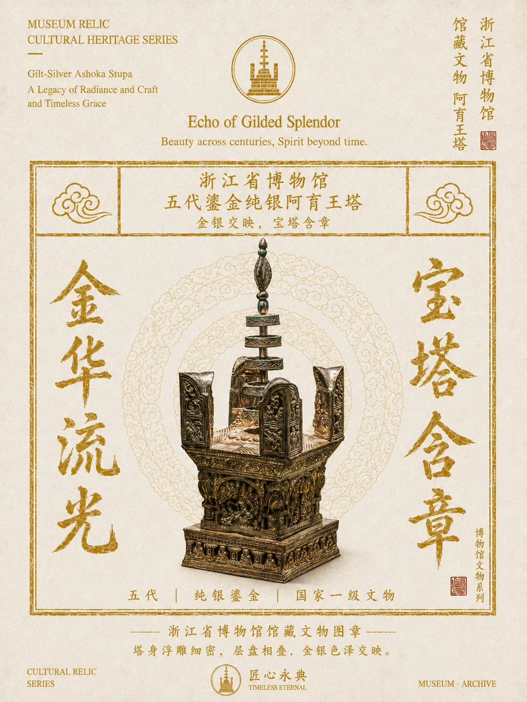
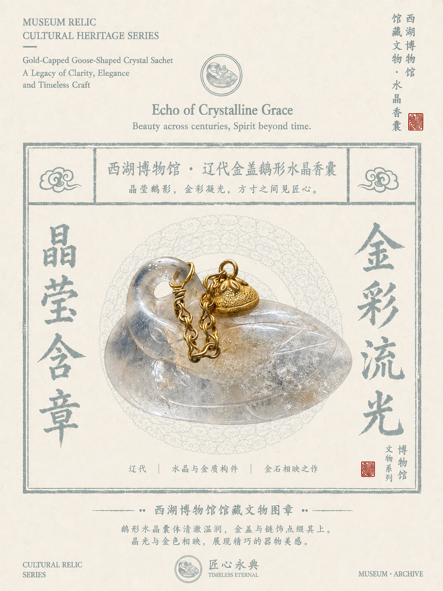
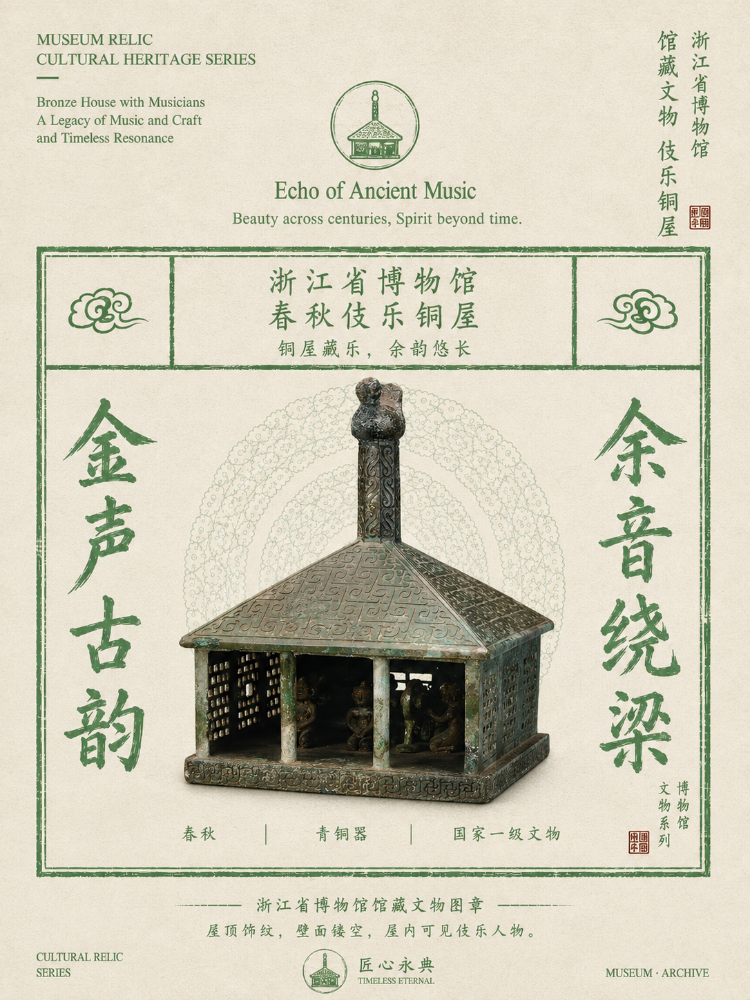
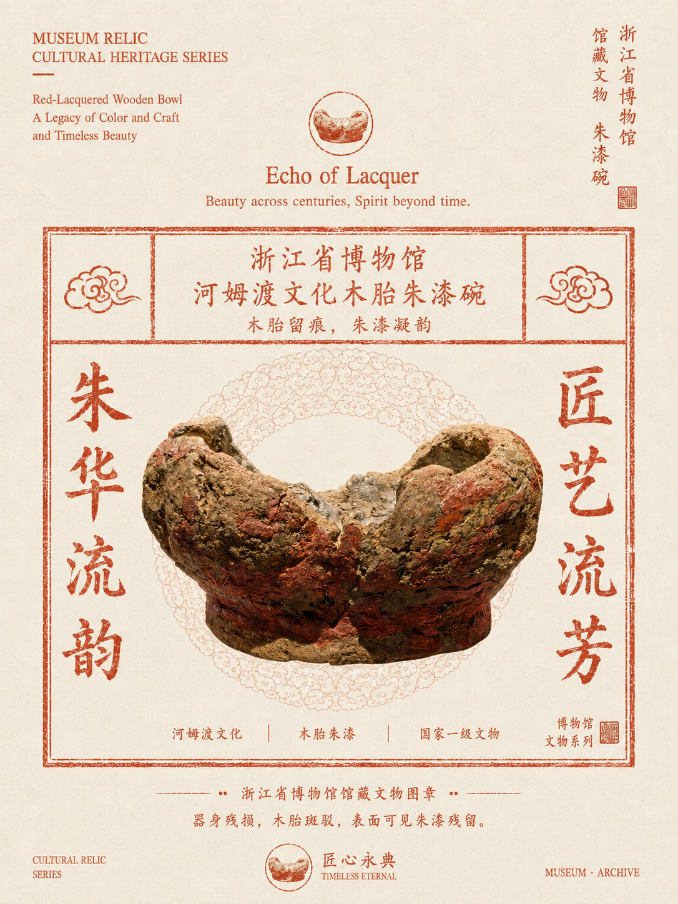
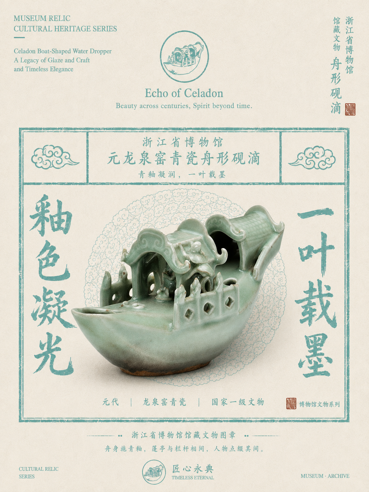

# 六种主题色成品样例

六张图片为用户与 AI 协作制作的自制样例，用户已于 2026-09-03 确认；由 @木渡川（TANGLELE）整理用于本 Skill，保持原始像素与文件内容。天青灰采用水晶香囊 v2 修正版；朱漆碗仅收录枫丹版。

| 主题色 | 目标印色 | 成品 | 实际尺寸 |
| --- | --- | --- | --- |
| 青蓝 | #176F91 | [良渚文化玉琮王](01-qinglan-jade-cong.png) | 1086 × 1448 |
| 鎏金 | #D4AF37 | [五代鎏金纯银阿育王塔](02-gold-ashoka-stupa.png) | 1086 × 1448 |
| 天青灰 | #A1B4B2 | [辽代金盖鹅形水晶香囊（修正版）](03-sky-gray-crystal-sachet.png) | 1086 × 1448 |
| 艾绿 | #7BAE7F | [春秋伎乐铜屋](04-ai-green-bronze-house.png) | 1086 × 1448 |
| 枫丹 | #D46A4A | [河姆渡文化木胎朱漆碗](05-maple-red-lacquer-bowl.png) | 1086 × 1448 |
| 青川 | #87BFB7 | [元龙泉窑青瓷舟形砚滴](06-qingchuan-celadon-boat.png) | 1086 × 1448 |

## 使用边界

- 这些成品用于主题印色气质、版式、材质呈现和文物徽记的参考；新文物的身份、形态和本色始终以用户素材为准，不继承样例中的馆名、年代、级别或说明。
- 背景仍固定为暖象牙 #F0ECE3；目标印色以本表及 Skill 配色表的 Hex 为准，直接写入提示词，成品中的磨损、浓淡与生成偏差不是精确色值标准。
- 六张历史成品均为 1086 × 1448（严格 3:4），不符合 Skill 默认 768 × 1024 或可选 1536 × 2048 的像素规格；这里只收作视觉样例，不放宽新生成的尺寸要求。
- 选色时展示新版六色总览；生成默认输入用户素材 + 对应主题样例，共两张。必要时只从这六张样例中再补一张构图相近的成品，总输入最多三张。印色名称与 Hex 直接写入提示词；综合色卡、旧十二兽首参考图和单色色卡截图不作为生成输入。
- manifest.json 记录来源文件名、实际尺寸与 SHA-256，用于核对原图完整性。

## 预览

### 青蓝 · 良渚文化玉琮王

### 鎏金 · 五代鎏金纯银阿育王塔

### 天青灰 · 辽代金盖鹅形水晶香囊（修正版）

### 艾绿 · 春秋伎乐铜屋

### 枫丹 · 河姆渡文化木胎朱漆碗

### 青川 · 元龙泉窑青瓷舟形砚滴

## 权利记录

制作来源已确认是我们自制的成品，不作为未知来源第三方海报处理。见 [素材记录](../rights-manifest.json)。自制样例中制作者有权授权的原创视觉贡献采用 [CC BY 4.0](../../LICENSE-ASSETS.md)，署名为 @木渡川（TANGLELE）；输入的官方图片等第三方内容仍按其适用条件使用，详见 [授权范围](../../references/rights-and-attribution.md#授权范围)。字体条件见 [字体使用说明](../../references/rights-and-attribution.md#字体使用说明)。
